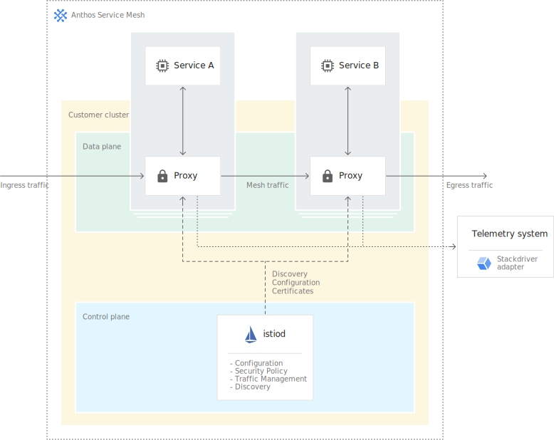

# GKE Service Mesh

Similar to other cloud Kubernetes providers, GKE also provides support for service meshes. For a quick refresher on what service meshes are, refer to the [service meshes](../ServiceMesh101/what-are-service-meshes.md) section. If you also want to get an insight into how service meshes are supported on Azure, that's is [also convered](../AKS101/aks-service-mesh.md).

This lesson will also assume you know what Istio is. If you would like to read further on the subject, please refer to the [Istio section](../ServiceMesh101/what-is-istio.md). The reason we would be looking at Istio is that we will be talking about the [Anthos Service Mesh](https://cloud.google.com/service-mesh/docs/overview), which is powered by Istio. Anthos also has full support on GCP, making it the easiest service mesh to set up on your GKE cluster.

The Anthos service mesh provides all the usual features you get from a service mesh, such as managing cluster traffic. This includes the ability to load balance services, perform blue-green deployments, and more. The service mesh applies across the entire infrastructure without having any impact on your code so that you don't have to change anything within your existing cluster. It also allows you to perform better monitoring and logging as well as security validation using things such as Anthos Service Mesh access logging, which keeps tabs on which IPs access the cluster, as well as control plane centric encryption modules. An overview of the architecture of the Anthos service mesh can be found below:

It's important to note that while Anthos works well with GKE, it is not limited to the Google Cloud Platform. When Anthos runs on GCP, it is used with an ordinary GKE cluster where the control plane is managed by Google while the worker nodes are compute engine instances. Anthos can also be used with other cloud service providers such as AWS and Azure. Alternatively, you could also run Anthos on your on-prem Kubernetes clusters.

Additionally, since Anthos gets applied across your entire infrastructure, you get management over multiple GKE clusters, which is really useful if you are in a large organization running multiple Kubernetes clusters. Anthos also provides a service mesh dashboard that gives you a complete overview of all the services in your mesh (your whole infrastructure). 

We've already spoken about Cloud Run and the benefits it can have over an ordinary Kubernetes cluster. Anthos allows you to get even more flexibility, as well as the functionality of a full-service mesh within your cloud run instance, with Anthos cloud run. You can test deploy their pre-built cloud run app with Anthos if you want to learn more by following this [tutorial](https://cloud.google.com/anthos/run/docs/deploy-application).

Now that you have a good idea of what Anthos is, and what it is capable of, you can follow a hands-on lab to familiarize yourself with Anthos with a [lab provided by Google](https://console.cloud.google.com/marketplace/details/click-to-deploy-images/anthos-sample-deployment). This lab will take you through doing a sample deployment on GCP which will give you practical experience of using Anthos.